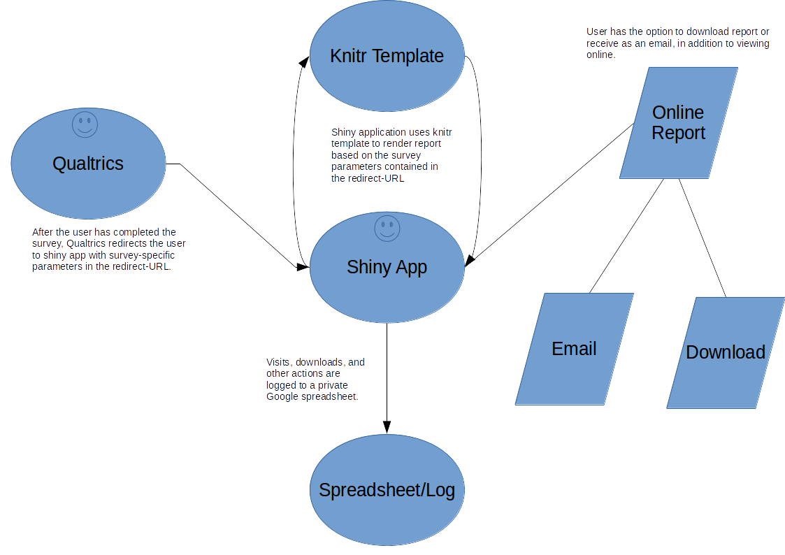
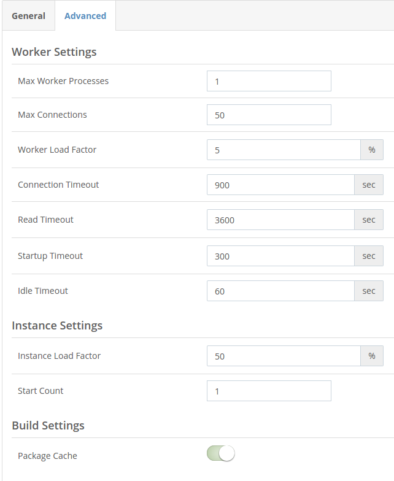

```{r setup, include=FALSE}
knitr::opts_chunk$set(echo = TRUE)
```

## Overview

The Qualtrics Reporting App is designed to present survey participants with a customized report after they have completed a survey. Qualtrics will redirect them to the reporting application and wil include relevant results from their survey in a custom URL. This URL will then be parsed by the Shiny application and a custom report generated.



## Deployment

1. Make sure you have the most recent stable release from source control. You can do this by either:
  a. Downloading the code from the repository manually ([here](https://bitbucket.org/ericscheier/qualtricsreports-shiny-app/downloads/))
  b. Cloning the repository:
    - In Windows use Git Bash, else use terminal
    - `git pull origin master` while in the QualtricsReports folder on your local machine
2. Open QualtricsReports.Rproj from within the source code folder (should open in RStudio)
3. Add your send-from email address credentials by doing the following:
  a. Create a copy of the file `email_base.txt` and name it `email.txt`. Edit `email.txt` to include your email username and password.
  b. Make sure that the email account information in the `emailReport` function in `helpers.R` is correct for your use-case. For instance, if you use a host other than gmail you will need to adjust the `smtp` setting here.
4. Make sure that you have all of the relevant packages installed. If not, you will get an error “there is no package called ‘X’” . To solve this, use install.packages(“X”) in Rstudio before running the app. Here are the packages required by the application:
```{r packages, eval=FALSE}
install.packages("shiny")
install.packages("shinyjs")
install.packages("knitr")
install.packages("rmarkdown")
install.packages("mailR")
install.packages("googlesheets")
install.packages('rsconnect')
install.packages('httr')
```
5. Test that the application runs locally on your machine by opening server.R and pressing the “Run App” button in the top right corner of the code window. Depending on your settings it will open in a pop-up window, an embedded Rstudio window, or a browser tab. When you are finished, or if you receive an error, remember to press the stop sign to stop the application from running.
6. Authenticate with google to enable logging (make sure you login with a google account that has write access to the logging document)
```{r google_oauth, eval=FALSE}
library(googlesheets)
token <- gs_auth(cache = FALSE)
gd_token()
saveRDS(token, file = "googlesheets_token.rds")
```
8. Change `offline <<- TRUE` to `offline <<- FALSE` in `server.R`. Save and test the application locally again to ensure that logging is working.
7. Link your Rstudio to your ShinyApps account (should only have to do this once)
```{r shinyapps_link, eval=FALSE}
require('devtools')
devtools::install_github('rstudio/shinyapps')
require('shinyapps')
shinyapps::setAccountInfo(name='yourUserNameHere', token='yourTokenHere', secret='yourSecretHere')
```
8. Deploy the application to ShinyApps.io
```{r deploy, eval=FALSE}
library(rsconnect)
deployApp()
```
The application can take some time to deploy. Once it has, a browser tab should open automatically pointing to learningforpurpose.shinyapps.io/QualtricsReports. This is the live application.
You can view its parameters and performance by finding the app in https://www.shinyapps.io/admin/#/applications/all. Here is a screenshot of the advanced settings I currently use:



## Setting Up Multiple Surveys
Adding a new survey to the application requires 3 steps:

1. Define the name of the survey and its parameters in the redirect-URL from Qualtrics (survey=report2&param1=one&param2=two)
2. Add any reference parameters to the Log Google Sheet’s Reference tab
3. Upload a new knirtr template to shinyapps.io with the same name (case-sensitive) as in the redirect-URL (report2.Rmd)

The Shiny application will automatically render the correct report based on the “survey” parameter contained in the Qualtrics redirect-URL.


## Using External Data

You should only reference survey-specific external data in the relevant post-survey report template (the knitr template). For instance, if the survey were assessing IQ and we wanted to show the user their IQ relative to the average, then we would include a variable for the average IQ in the report template and update it regularly.

To refer to a dynamically updated reference value, add it to the Log Google Sheet’s Reference tab. The columns on that tab are defined as follows:

  - Survey: same name as the “survey” variable in the redirect-URL and the name of the knitr template without the Rmd extension (e.g. ExampleReport.Rmd = ExampleReport)
  - Parameter: the name of the parameter to be referenced. In the knitr template you will need to add a “ref.” to this parameter to avoid overlapping names. It is okay to repeat variable names among different surveys because the application will only look for variables related to the survey it is trying to render (e.g. having IQ for SurveyA and IQ for SurveyB is okay)
  - Value: the numeric value of the reference parameter

There is code in the “setup” (first) chunk of the sample template to demonstrate the functionality. After you have defined the variables and uploaded relevant data, you can refer to them as you would any other variable in a knitr document.
